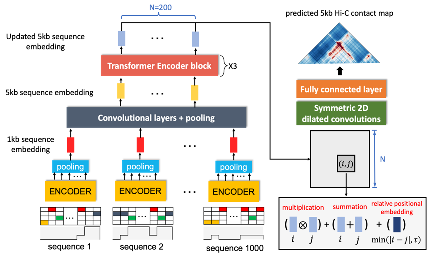

# Chromatin contact map prediction task

### Model archietecture to predict 5kb-resolution Hi-C contact maps

## Data preparing

In the downstream task of chromatin contact map prediction, the chromatin contact maps are downloaded from 4DN, which are OE-normalized using Juicebox. For example, we download 'GM12878.hic' file of GM12878 Hi-C contact map with 4DN accession number [4DNFI1UEG1HD](https://data.4dnucleome.org/files-processed/4DNFI1UEG1HD/), we use the following python code to obtain the OE-normalized contact maps saved as python sparse matrices. 
```
import os,straw
from scipy.sparse import csr_matrix,save_npz
from util import txttomatrix
os.system('mkdir GM12878_Hi-C')
resolution=5000
chrs = [str(i) for i in range(1, 23)] + ['X']
for chr in chrs:
    f = open('GM12878_Hi-C/chr%s_%s.txt' % (chr,resolution), 'w')
    result = straw.straw('oe', 'NONE','GM12878.hic', chr, chr,
                             'BP', resolution)
    for i in range(len(result)):
        f.write("{0}\t{1}\t{2}\n".format(result[i].binX, result[i].binY, result[i].counts))
    f.close()
    
genome_lens = [248956422, 242193529, 198295559, 190214555, 181538259, 170805979, 159345973,
                145138636, 138394717, 133797422, 135086622, 133275309, 114364328, 107043718,
                101991189, 90338345, 83257441, 80373285, 58617616, 64444167, 46709983, 50818468, 156040895]
genome_lens=np.array(genome_lens)//resolution
for i in range(len(chrs)):
    length=genome_lens[i]
    txtfile='GM12878_Hi-C/chr%s_%s.txt'%(chrs[i],resolution)
    row,col,data=txttomatrix(txtfile,resolution)
    temp=csr_matrix((data, (row, col)), shape=(length, length))
    save_npz('GM12878_Hi-C/chr%s_5kb.npz'%(chrs[i]),temp)
```

## Download trained models
```
pip install gdown
# 5kb-resolution Hi-C 
gdown 1EXm2AjqqO-UtLi2pprbDEb1gPXrxI3aW --output models/hic_GM12878_transformer.pt
gdown 1ofkpS526gXpnusGpRWVHgIFFFpTSW4Rm --output models/hic_IMR-90_transformer.pt
gdown 1ia-ZoSoiZGDFPnZcySzMpirovHhulRfH --output models/hic_HFF_transformer.pt

# 1kb-resolution Micro-C
gdown 1PUQyBdqadq2AI9IZPpeAYc5zwjWeoph7 --output models/HFF_Micro-C_transformer.pt
```

## Usage
For model training, please see ```downstream_train_hic.py```, e.g., ```python downstream_train_hic.py --fine_tune```

For inference (e.g., cross-cell type prediction), please see ```cross_cell_type_test.py```
