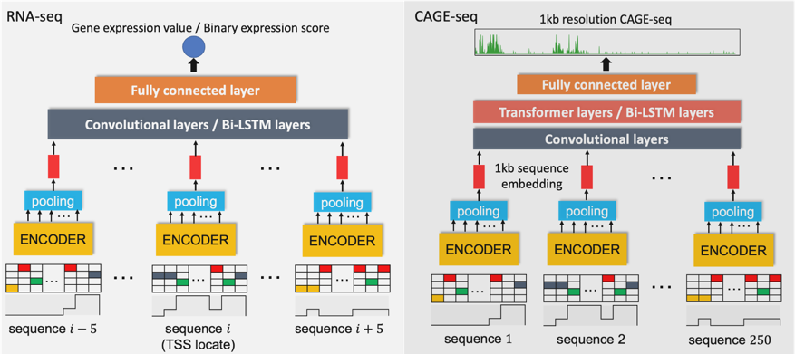

## Downstream model architecture


  
  
 ## Data
For RNA-seq GEP, we download the datasets of DeepChrome and AttentiveChrome from [https://zenodo.org/record/2652278#.Yow84ZPMKAk](https://zenodo.org/record/2652278#.Yow84ZPMKAk), and GC-MERGE data from [https://github.com/rsinghlab/GC-MERGE/tree/main/src/data](https://github.com/rsinghlab/GC-MERGE/tree/main/src/data). Our code to prepare training data is shared in [prepare_train_data.py](https://github.com/liu-bioinfo-lab/EPCOT/blob/main/GEP/rnaseq/prepare_train_data.py)

For CAGE-seq GEP, we download CAGE-seq bam files from ENCODE and use samtools to merge replicates, and then use [bam_cov.py](https://github.com/calico/basenji/blob/master/bin/bam_cov.py) and [data_read.py](https://github.com/liu-bioinfo-lab/EPCOT/blob/main/GEP/cage/data_read.py)  to convert the bam files into bigWig and process the data.

## Download trained downstream models
The model to complete RNA-seq GEP classification task can be downloaded from Google Drive, which is trained on four cell types: H1, A549, GM12878, and HeLa-S3.

```
pip install gdown
gdown 1r1Jg-6BOUpibmGrruPmowOD3dUN5sHYn --output models/gex_classification_cnn.pt
```


The model to predict 1kb-reolustion CAGE-seq with transformer layers in the downstream model is provided. This model is trained on four cell types: GM12878, K562, HUVEC, and IMR-90.
```
gdown 1eP-ruOcywlGeQIRuVwWk_QFc4z9j4-jF --output models/cage_transformer.pt
```

## Training models from scratch

For RNA-seq GEP, please refer to the script [downstream_train_rnaseq.py](https://github.com/liu-bioinfo-lab/EPCOT/blob/main/GEP/downstream_train_rnaseq.py) . For CAGE-seq GEP please refer to the script [downstream_train_cage.py](https://github.com/liu-bioinfo-lab/EPCOT/blob/main/GEP/downstream_train_cage.py).  For example,
```python downstream_train_cage.py --fine_tune --pretrain_path models/pretrain_dnase.pt```
