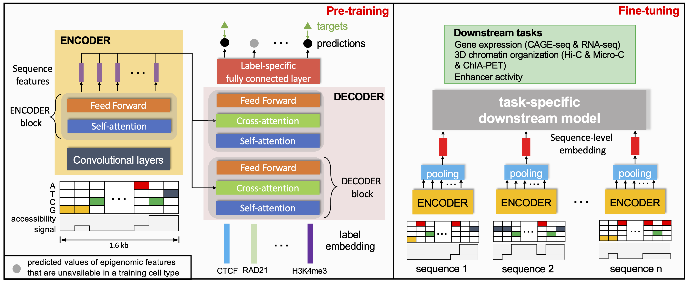

# EPCOT


EPCOT (comprehensively predicting <ins>EP</ins>igenome, <ins>C</ins>hromatin <ins>O</ins>rganization and <ins>T</ins>ranscription) is a comprehensive model to jointly predict epigenomic features, gene expression, high-resolution chromatin contact maps, and enhancer activities from DNA sequence and cell-type specific chromatin accessibility data. 


  
 ## Dependencies
* einops (0.3.2)
* kipoiseq (0.5.2)
* numpy (1.19.5)
* torch (1.10.1)
* scipy (1.7.3)
* scikit-learn (1.0.2)

You can use ```conda``` and ```pip``` to install the required packages
```
conda create -n epcot python==3.9
conda activate epcot
pip install -r requirements.txt
```
  

 ## Usage
 
### Prepare inputs to EPCOT
Please go to the directory [Data/](https://github.com/liu-bioinfo-lab/EPCOT/tree/main/Data) for how to generate the inputs to EPCOT (one-hot repsentations of DNA sequences and normalized DNase-seq).

### Download the pre-training model and downstream models
You can download our pre-training model from Google Drive
```
pip install gdown
!gdown 1_YfpNSv-2ABQV2qSyBxem-y7aJFyRNzz --output models/pretrain_dnase.pt
```

For the trained downstream models and how to train downstream models from scratch, you can go to each correspoding directory [GEP/](https://github.com/liu-bioinfo-lab/EPCOT/tree/main/GEP), [COP/](https://github.com/liu-bioinfo-lab/EPCOT/tree/main/COP), and [EAP/](https://github.com/liu-bioinfo-lab/EPCOT/tree/main/EAP).

### EPCOT tutorial
We prepare a Google Colab Notebook [EPCOT_usage.ipynb](https://github.com/liu-bioinfo-lab/EPCOT/tree/main/EPCOT_usage.ipynb) to introduce how to use EPCOT to predict multiple modalities and train logistic regression model using the predicted values of epigenomic features from the pre-training model.

### Documents and webpages
We prepare a webpage of our TF sequence binding patterns along with Tomtom motif comparison results, you can download the webpage in [sequence_pattern_webpage](https://github.com/liu-bioinfo-lab/EPCOT/tree/main/sequence_pattern_webpage) to search for TFs of interest, and we also summarize the results in an EXCEL file [motif_comparison_summary.xls](https://github.com/liu-bioinfo-lab/EPCOT/tree/main/motif_comparison_summary.xls)
